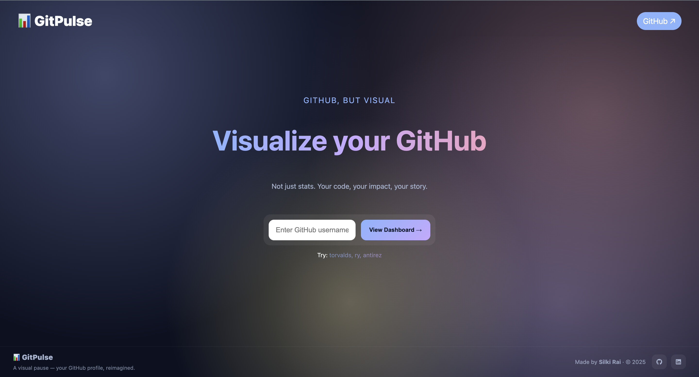
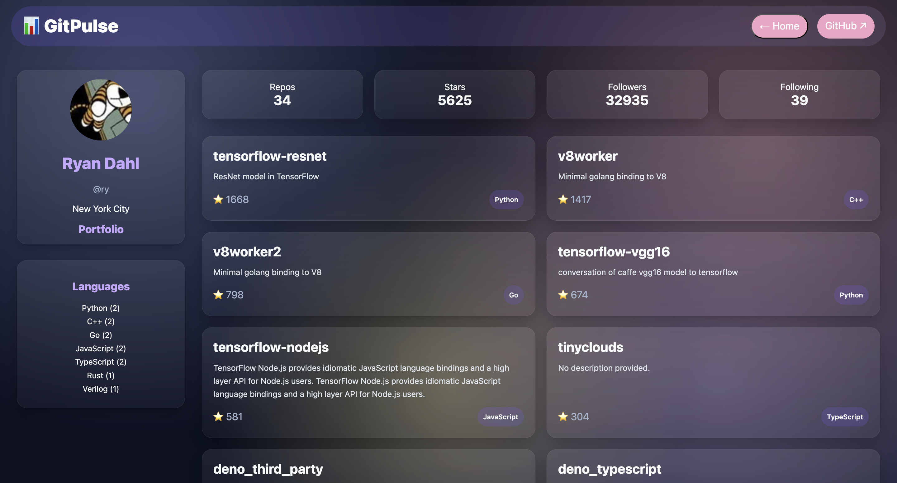

# GitPulse 📊

A visual GitHub profile dashboard built with React and GitHub GraphQL API to visualize GitHub data in a clean and simple way.

Instead of just numbers and plain lists, this project focuses on presenting a GitHub profile, repositories, and languages in a modern UI that is easy to understand and pleasant to use.

---

## Features

- Search any GitHub username
- Profile overview (avatar, name, bio, location, website)
- Repository list with stars and primary language
- Language usage summary
- Dark, glassmorphism-inspired UI
- Fully responsive
- Fast data fetching using GitHub GraphQL API
- Direct links to GitHub profile and repositories

---

## Why I made this

I wanted to build something that:
- Uses **real GitHub data**
- Looks **clean and modern**
- Handles **edge cases** like user not found
- Is responsive on all screen sizes
- Can be used as a **portfolio project**

---

## 🖥️ Tech Stack

- React + Vite
- CSS (no frameworks)
- GitHub GraphQL API
- Vercel for deployment

---

## 🚀 Live Demo

👉 (https://gitpulse-three.vercel.app/)

---

## 📸 Screenshots

### Home Page

### Dashboard

---

## 🧑‍💻 How to use the app

1. Open the app
2. Enter a GitHub username
3. Press **Enter** or click **View Dashboard**
4. You can see:
   - Profile information
   - Repository list
   - Language summary
5. Click on:
   - Profile image / name → GitHub profile
   - Repository card → GitHub repository

If the username does not exist, an error message is shown.

---

## 📄 License

This project is licensed under the MIT License.

---

✨ **Hey there!**

Thanks for visiting this repository.  
This project was made with lots of curiosity.

Take a moment to try it out.  
Happy coding! 
